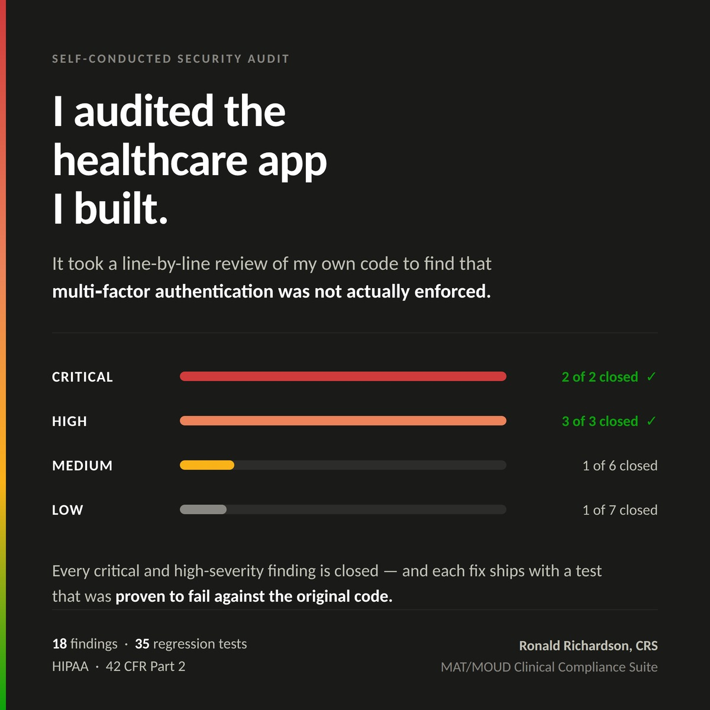

# MOUD Compliance Suite — Security Audit

A self-conducted static security code review of a HIPAA and 42 CFR Part 2 healthcare application I designed and built.

**18 findings identified. Every critical and high-severity finding closed and regression-tested.**



---

## What this repository is

This is the **public methodology and outcomes** record of a security assessment. The system under review is the MAT/MOUD Clinical Compliance Suite, a multi-tenant SaaS application that tracks clinician credentials for clinics treating opioid use disorder. It stores protected health information and is governed by both the HIPAA Security Rule and 42 CFR Part 2 — the stricter federal rule under which the mere association of a person with an addiction treatment program is itself protected information.

The application source is private. **The full assessment report is not published here**, because eleven findings remain open on a live system; publishing their file locations would be a roadmap for attacking it. What is published is the methodology, the severity distribution, the remediation approach, and detailed write-ups of defects that are now fixed.

That distinction is itself part of the exercise. Deciding what is safe to disclose, and when, is a security judgment.

| Document | Contents |
|---|---|
| [`docs/Security_Assessment_Portfolio_Summary.pdf`](docs/Security_Assessment_Portfolio_Summary.pdf) | Three-page assessment summary — methodology, findings distribution, remediation approach |
| This README | Full narrative, the primary case study, and what I would do differently |

---

## Why audit my own code

I wrote this application, including its security controls, and designed them deliberately. That is precisely why it needed auditing.

"I was careful when I built it" is a claim about intent, not about outcomes, and it is not something a clinic's security reviewer can act on. The purpose was to treat my own work the way I would treat a system I had never seen — specifically, to look for the gap between what the code *claims* to do and what it *actually* does.

That gap turned out to be real, and the most severe finding sat exactly where I would have told you the system was strongest.

---

## Methodology

A manual, white-box review in five phases. Deliberately not a scanner run: automated tooling is good at finding known-vulnerable dependencies and poor at finding a correctly-structured control configured with the wrong values, which was the failure mode that mattered most here.

**1 · Scoping.** Inventory the attack surface before scoring anything — every route and its middleware chain, the identity and tenancy layers, file upload and storage paths, the audit subsystem, database schema and access policies, dependency manifests, and repository history.

**2 · Claim-to-code tracing.** For each security property the application documents or markets, locate the code implementing it and verify the implementation is *correct*, not merely *present*. A control that exists is not a control that works.

**3 · Control-by-control review.** File-by-file manual reading of all security-relevant source: authentication, authorization tiers, tenant isolation, PHI handling and masking, input validation, audit coverage.

**4 · Supply chain and repository hygiene.** Dependency vulnerability review, unused and misplaced dependency checks, git history inspection for previously committed secrets.

**5 · Re-verification.** Findings re-confirmed against live source on later dates rather than assumed still valid. This caught a false alarm on one pass — roughly fifty files appeared modified, but the diff proved to be pure line-ending conversion with no substantive change.

Severity was assigned by impact on the confidentiality, integrity, and auditability of patient data — **not** by how difficult a finding was to fix. Each finding was mapped to the specific HIPAA Security Rule or 42 CFR Part 2 provision it implicates, so the output is actionable by a compliance reviewer rather than only an engineer.

---

## Findings distribution

| Severity | Found | Closed | Definition applied |
|---|---|---|---|
| **Critical** | 2 | **2** | Defeats a stated security control protecting PHI |
| **High** | 3 | **3** | Direct PHI exposure or integrity risk, or a security feature that does not work |
| **Medium** | 6 | 1 | Weakens defense in depth, or leaves a compliance obligation unevidenced |
| **Low** | 7 | 1 | Hygiene, maintainability, and information-disclosure issues |

Closed findings are retained in the working log with their remediation recorded rather than deleted, so the document functions as an audit trail rather than a to-do list. A findings log containing only closed items is not evidence of a security program.

### What the findings were about

Described by category rather than by location:

- **Identity controls whose implementation did not match their documented intent** — the most severe category, and the case study below.
- **Development conveniences reachable in production**, where the only thing restricting them was a client-side check rather than a server-side control.
- **PHI reaching systems not treated as PHI stores** — logs, object-storage metadata, outbound notifications. Two of these turned specifically on 42 CFR Part 2 rather than general HIPAA.
- **Audit coverage gaps** — reads that returned PHI without generating an audit record, and an audit table not protected by the same database-level isolation as the primary data table.
- **Absent baseline hardening** — security headers, rate limiting, test coverage, error-message discipline, dependency placement, logging structure.

---

## Case study: a control that passed review and did not work

The highest-severity finding was in multi-factor authentication.

The application validates the identity provider's authentication-method claim (`amr`) against an allow-list of acceptable methods. The structure was right. The check ran on every protected route. The file's header comment stated that MFA was enforced. The rejection message it returned was stricter than most production systems I have seen — it explicitly refused SMS as a second factor.

The allow-list itself read:

```
['pwd', 'totp', 'otp', 'fido', 'fido2', 'mfa']
```

`pwd` is the identity provider's value for an ordinary password-only login. Its presence meant **every authenticated session satisfied the MFA requirement.** The control was inert.

Nothing about reading the surrounding logic would have revealed this, because the surrounding logic was correct. Only comparing the permitted values against the identity provider's actual claim semantics exposed it.

### The corrected implementation

```ts
// Deliberately excluded — do not re-add without reading this comment:
//   'pwd'  password-only login. NOT a second factor. Including it makes the
//          check below pass for every authenticated session.
//   'otp'  ambiguous; the provider emits 'totp' for authenticator-app verification.
const ACCEPTED_MFA_METHODS: readonly string[] = ['mfa', 'totp', 'fido', 'fido2'];
```

Three changes, not one:

1. **The values are correct.**
2. **The list is a named constant carrying the rationale for each exclusion**, so the original mistake cannot be reintroduced by someone reasonably assuming an omission.
3. **The claim is coerced to an empty array when absent or malformed**, so a broken token fails closed rather than throwing.

### What generalizes

- A security control can be **structurally correct and semantically wrong**. Reviewing the shape of a check is not reviewing the check.
- **Documentation and error messages are evidence of intent, not evidence of behavior.** Here they actively increased confidence in a control that was not functioning.
- This class of defect is invisible to code review and to dependency scanning, and visible immediately to a single test. That is an argument for **tests as a security control**, not merely a quality one.

---

## Remediation approach

Findings were sequenced by severity and by whether they gate a pilot handling real patient data — not in discovery order, and not easiest-first.

**Defense in depth over single fixes.** A production-reachable development endpoint was not simply gated. It is now excluded from production registration entirely *and* independently authorization-gated and audit-logged in every other environment, so no single mistake re-exposes it.

**Fail closed.** Where a control depends on an external claim, a missing or malformed value is treated as a failure rather than an absent condition. The document-release path refuses to issue a link if it cannot first write the audit record — a failed audit is a failed request, not a warning on stderr.

**Document the exclusion, not just the inclusion.** Corrected allow-lists name what was deliberately left out and why.

**Prefer no dependency to a small one.** Validating that an uploaded file is genuinely the type it claims to be could have been a third-party package. For three permitted formats it is fifteen lines of explicit, auditable byte comparison instead. Every dependency added to a system holding patient data is surface someone else controls — and this codebase already carried a finding for an unused dependency.

**Prove the test catches the bug.** Thirty-five automated tests now guard the corrected controls. Before accepting each suite, I restored the original defective code and confirmed the tests failed, then restored the fixes and confirmed they passed:

| Suite | Reverted to | Result |
|---|---|---|
| MFA enforcement | original `amr` allow-list | 2 tests failed ✓ |
| Presigned URLs | 7-day expiry | expiry assertion failed ✓ |
| Upload validation | client-declared type trusted | 3 tests failed ✓ |

**A test that has never been shown to fail is not yet evidence of anything.**

**Track honestly.** Eleven findings remain open and are documented as open, severity-ranked and sequenced.

---

## Regulatory mapping

Findings were mapped to the provisions they implicate — HIPAA Security Rule citations for authentication (§164.312(d)), access control (§164.312(a)(1)), audit controls (§164.312(b)), integrity (§164.312(c)(1)), transmission security (§164.312(e)(1)), and evaluation (§164.308(a)(8)), plus 42 CFR Part 2 for the disclosure-specific findings and HIPAA's Minimum Necessary standard (§164.502(b)).

A forward-looking note was included: the proposed HIPAA Security Rule update published as an NPRM in January 2025 would reclassify multi-factor authentication and encryption from *addressable* to *required*. That rule is not final and creates no obligation today — but it means the highest-severity finding sat on a control trending from recommended toward mandatory, which is a reason to weight it higher in sequencing than its immediate exploitability alone would suggest.

### Frameworks deliberately declined

Deciding what *not* to build is part of compliance analysis. Claiming coverage of a framework that does not apply signals a misread of the buyer's risk profile rather than thoroughness.

- **HITECH** — amended HIPAA; its requirements are already covered by the HIPAA work rather than constituting a separate system.
- **HITRUST** — certification is a paid third-party assessment; no software can grant it. A CSF self-assessment tracker is buildable and useful; a claim of certification is not.
- **GDPR** — no plausible trigger for clinics serving a Philadelphia patient population.

---

## What I would do differently

- **Write the test with the control.** The MFA defect existed because the test harness was installed but never configured — the test command silently had nothing to run for the entire life of the project.
- **Check claim semantics at integration time.** Every value in that allow-list should have been verified against the identity provider's documentation the day it was written.
- **Audit earlier and on a schedule.** A single point-in-time review is a snapshot. A dated, versioned series showing findings closed over time is what actually evidences an operating security program.

---

## Skills demonstrated

Threat-informed manual code review · authentication and authorization analysis · multi-tenant isolation review · PHI data-flow tracing · audit-coverage assessment · risk-based severity ranking · HIPAA Security Rule and 42 CFR Part 2 control mapping · remediation planning and sequencing · security regression testing · findings documentation for both engineering and compliance audiences.

---

## Related work

- **[Botium-Compliance-Audit](https://github.com/IAM-ZeroTrustRon/Botium-Compliance-Audit)** — NIST CSF audit with PCI DSS, GDPR, and SOC mapping, and a likelihood × impact risk heat map.
- **[MedNet-Sentinel-Splunk](https://github.com/IAM-ZeroTrustRon/MedNet-Sentinel-Splunk)** — Splunk detection engineering lab: synthetic hospital log generation and SPL detection content for a three-stage attack chain.

---

**Ronald Richardson, CRS** · Philadelphia, PA · [ronrichardsonit@gmail.com](mailto:ronrichardsonit@gmail.com)

*Certified Recovery Specialist with five years of clinical case management in behavioral health, transitioning into healthcare GRC and IAM. CompTIA Security+ (SY0-701).*
